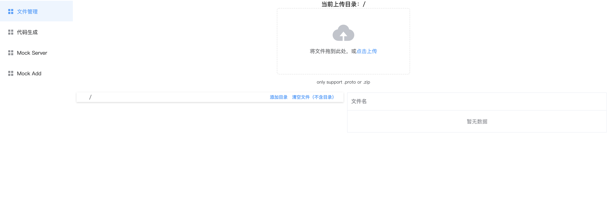
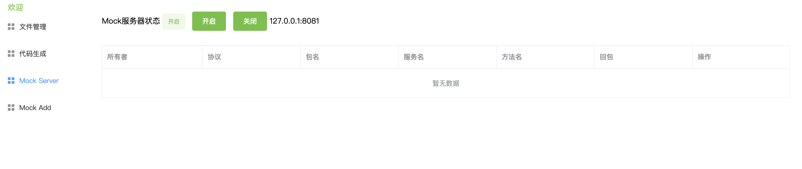

基于`nodejs`，包含`mock-server`和`web client`的`grpc-mock`框架。

## 主要功能：

### 1. proto文件管理

### 2. 用户管理

### 3. 协议mock的server实现（基于grpc-nodejs和mongoose）

### 4. 代码模板生成（待实现）

## 部署使用

### mongoose安装

安装：[https://docs.mongodb.com/manual/tutorial/install-mongodb-on-red-hat/](https://docs.mongodb.com/manual/tutorial/install-mongodb-on-red-hat/)

```
db名：atool
```

### server部署

```
# 安装pm2
npm install pm2 -g
cd server
npm install
# 开发环境
npm run dev
# 生产环境
npm run prd
# 环境配置文件
server/config/development.env.js
server/config/production.env.js
```

### web部署

```
cd web
npm install
# 开发环境
npm run serve
# 生产环境
npm run build
# 环境配置文件
web/.env.production
web/.env.development
```

## 预览




