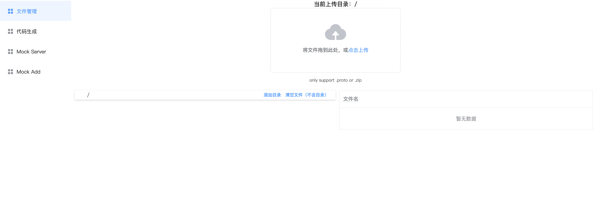
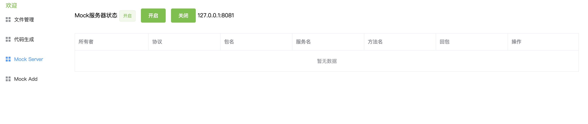

Based on `nodejs`, a `grpc-mock` framework including `mock-server` and `web client`.

## The main function:

### 1. proto file management

### 2. User Management

### 3. Server implementation of protocol mock (based on grpc-nodejs and mongoose)

### 4. Code template generation (to be implemented)


## Deploy and use

### mongoose installation

Install：[https://docs.mongodb.com/manual/tutorial/install-mongodb-on-red-hat/](https://docs.mongodb.com/manual/tutorial/install-mongodb-on-red-hat/)

```
db name：atool
```

### server deployment

```
# Install pm2
npm install pm2 -g
cd server
npm install
# Development environment
npm run dev
# Production Environment
npm run prd
# Environment configuration file
server/config/development.env.js
server/config/production.env.js
```

### web deployment

```
cd web
npm install
# Development environment
npm run serve
# Production Environment
npm run build
# Environment configuration file
web/.env.production
web/.env.development
```

## Preview



